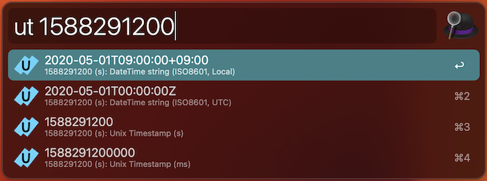
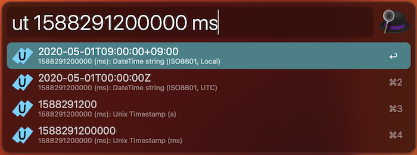
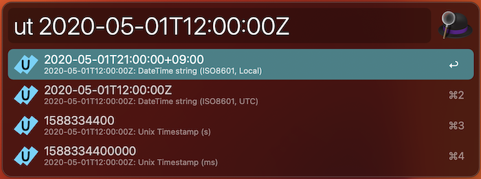

# alfred-unixtime-converter

Unixtime converter available as alfred workflow.

## How to use

Download a package from [release page](https://github.com/ytakahashi/alfred-unixtime-converter/releases) and install.

Activate Alfred and type `ut`.  
Input date string or unix timestamp and you see converted results.

### Acceptable input format

#### Unix Timestamp

Unix timestamp (epoch second)

- example: `1588291200`

Unit (`s` or `ms`) can be specified (defaults to `s`)

- example: `1588291200000 ms`

#### Datetime

ISO 8601 date string

- example: `2020-05-01T12:00:00Z`

`yyyy-` or `yyyy-mm-ddT` can be omitted. If omitted, current year/date is applied.
